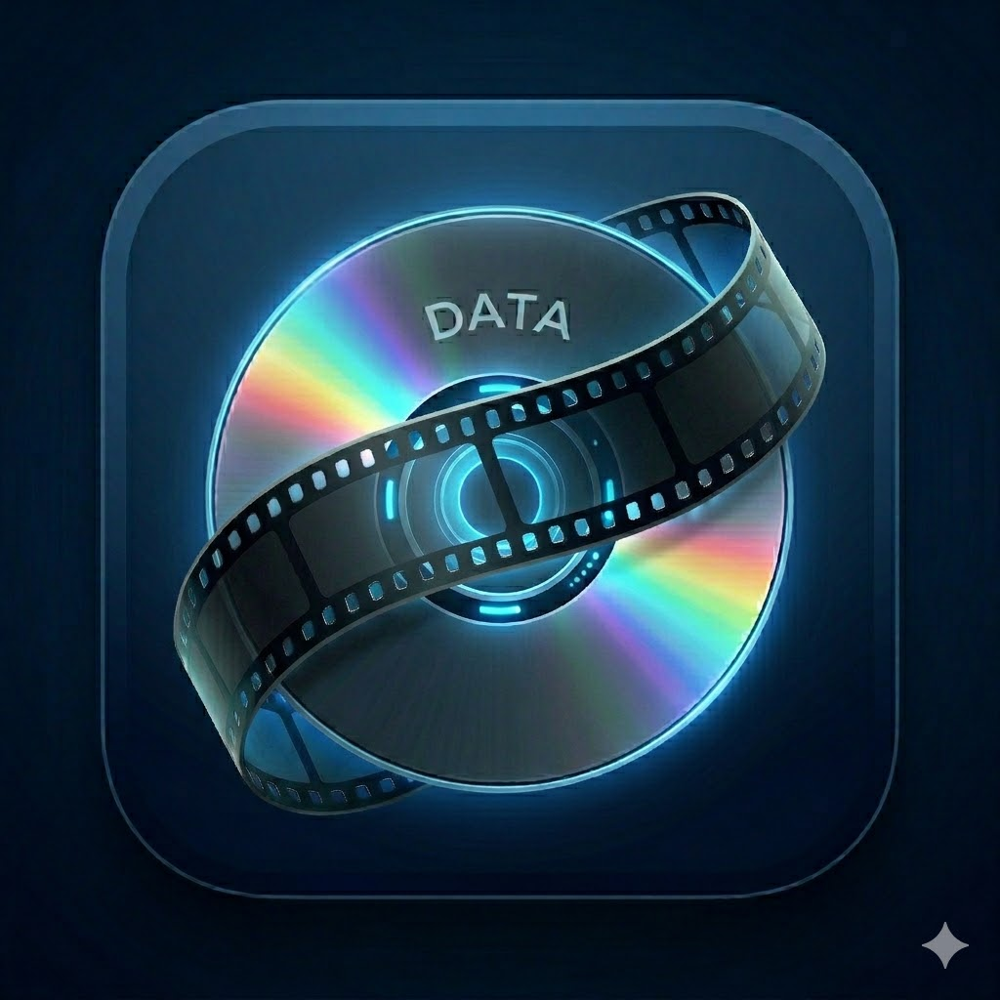
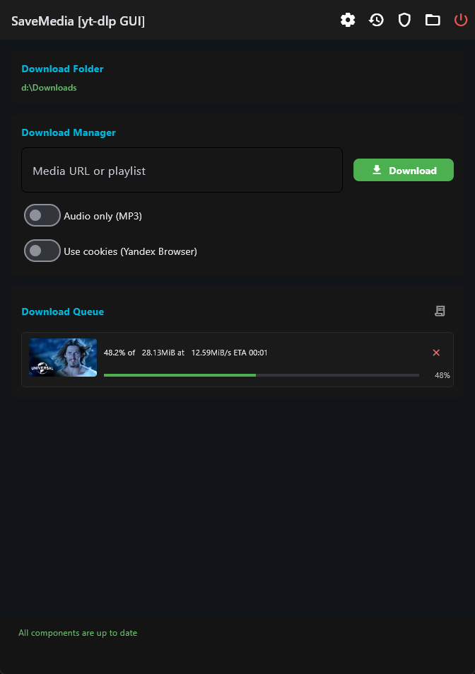
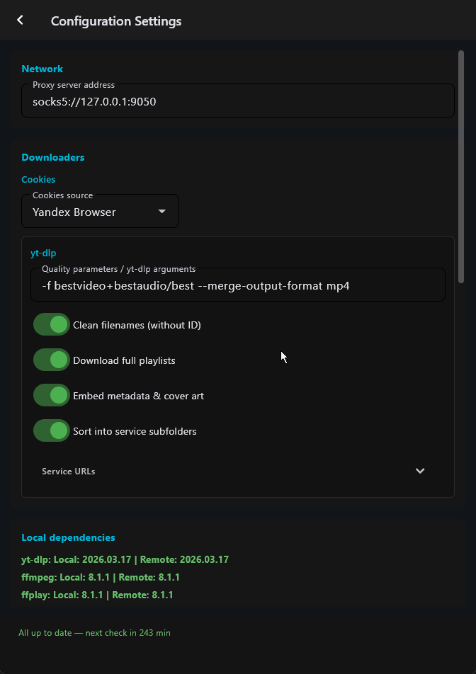
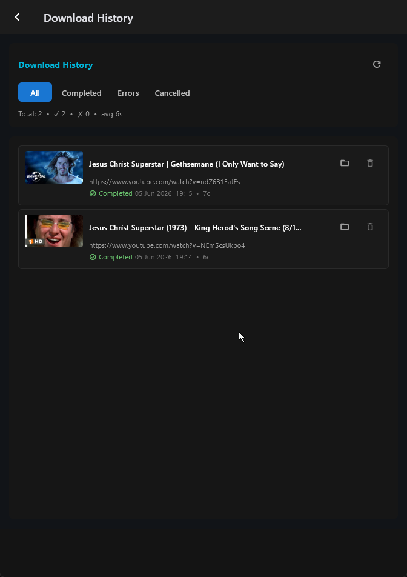

# SaveMedia

**Удобный графический интерфейс для yt-dlp + ffmpeg**  
Скачивай видео, плейлисты, Shorts, музыку и любой другой контент с YouTube, VK, Rutube, Telegram и десятков других сайтов — красиво, быстро и без рекламы.



## ✨ Возможности

- **Современный и приятный интерфейс** на Flet (Python)
- Поддержка **тысяч сайтов** через yt-dlp
- Скачивание видео, аудио, плейлистов, субтитров
- Автоматическое обновление yt-dlp и ffmpeg
- Темная тема + сохранение настроек и позиции окна
- История скачиваний
- Работа в фоне + уведомления
- Локализация (русский + английский)
- Прокси, cookies, кастомные аргументы yt-dlp
- Thumbnail-превью

## 📸 Скриншоты







## 🚀 Быстрый старт

### Установка

1. Скачай последнюю версию из [Releases](https://github.com/godsfear/SaveMediaClasses/releases)
2. Распакуй архив
3. Запусти `SaveMedia.exe` (Windows) или `python main.py` (все платформы)

### Или из исходников

```bash
git clone https://github.com/godsfear/SaveMediaClasses.git
cd SaveMediaClasses

# Рекомендуется uv
uv sync
uv run python main.py
```

## 🛠 Требования

Python 3.11+
yt-dlp и ffmpeg (устанавливаются автоматически)

📖 Как использовать

Вставь ссылку → выбери формат → нажми «Скачать»
Можно добавлять сразу несколько ссылок
В настройках: прокси, папка сохранения, язык, качество по умолчанию и т.д.

## 🛣️ Планы на будущее

Пресеты настроек (музыка / 4K / аудиокнига и т.д.)
Загрузка с torrent, metalink, magnet

## 🙏 Благодарности

yt-dlp — основа проекта

Flet — UI-фреймворк

## 📄 Лицензия
MIT License. См. файл LICENSE.
