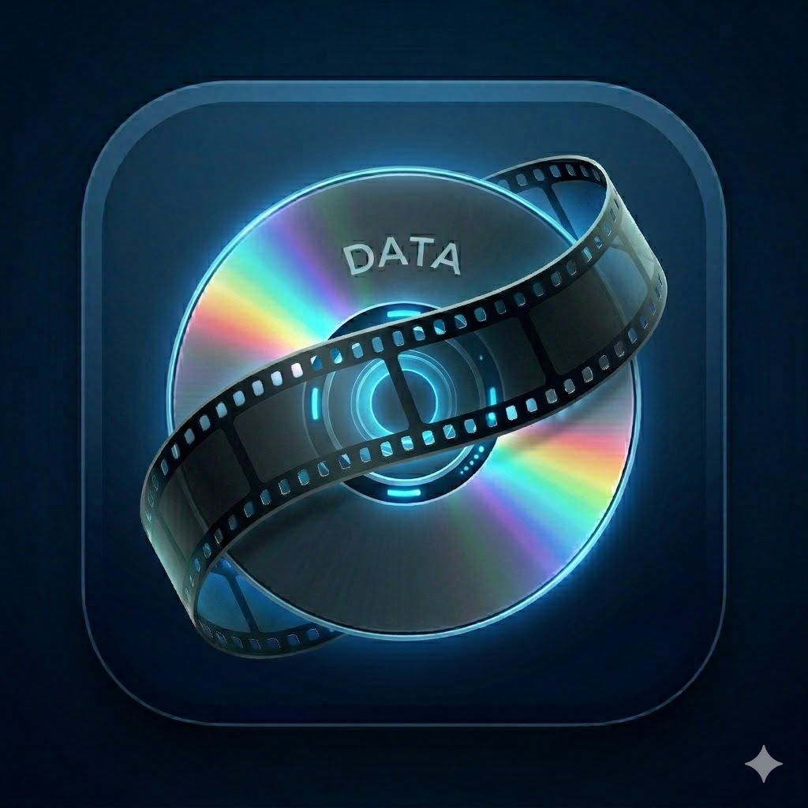
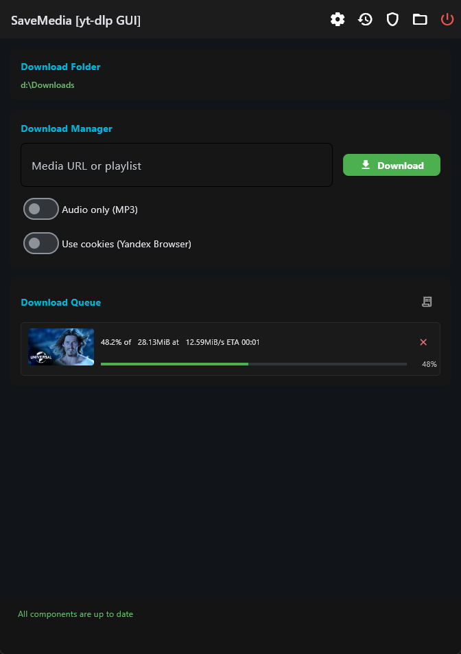
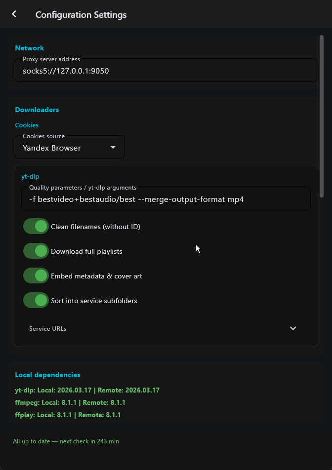
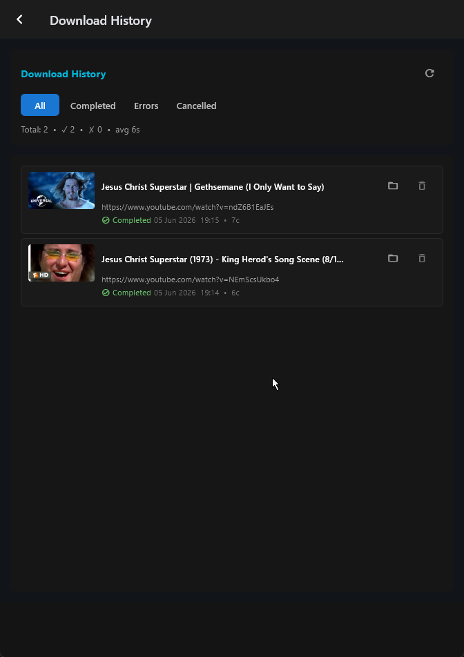

# SaveMedia

**A convenient graphical interface for yt-dlp + aria2c**

Download videos, playlists, Shorts, music and any other content from YouTube, VK, Rutube, Telegram and dozens of other sites — beautifully, quickly and ad-free.



## ✨ Features

- **Modern, pleasant interface** built with Flet (Python)
- Support for **thousands of sites** via yt-dlp
- Download video, audio, playlists, subtitles
- System-first discovery and automatic updates for yt-dlp, Deno, ffmpeg and aria2c
- Dark theme + persistence of settings and window position
- Download history
- Background operation + notifications
- Localization (Russian + English)
- Proxy, cookies, custom yt-dlp arguments
- Thumbnail previews

## 📸 Screenshots







## 🚀 Quick start

### Installation

1. Download the latest version from [Releases](https://github.com/godsfear/SaveMediaClasses/releases)
2. Extract the archive
3. Run `SaveMedia.exe` (Windows) or `python main.py` (all platforms)

### Or from source

```bash
git clone https://github.com/godsfear/SaveMediaClasses.git
cd SaveMediaClasses

# uv is recommended
uv sync
uv run python main.py
```

## 🛠 Requirements

Python 3.12+

The app first uses tools already installed on the system. Missing or
non-updatable dependencies (yt-dlp, Deno, ffmpeg and aria2c) are installed into
the app-managed `tools` directory as a fallback.

### External tool manifests

Version probes, self-update commands, package-manager commands and installation
detectors are declarative and can be overridden in `config.json`. Commands are
stored as argv arrays and are never evaluated by a shell. For example:

```json
{
  "tools": {
    "deno": {
      "binaries": {
        "deno": {"version_probe": {"args": ["--version"]}}
      },
      "self_update": {"args": ["upgrade"]}
    }
  },
  "tooling": {
    "package_managers": {
      "uv": {
        "executable": "uv",
        "upgrade": {"args": ["tool", "upgrade", "{package_id}"]}
      }
    }
  }
}
```

Only allowlisted placeholders are accepted: `{package_id}` for upgrades and
`{proxy_url}` for optional package checks. Invalid command overrides fall back
to the built-in manifest.

📖 How to use

Paste a link → choose a format → click "Download"
You can add several links at once
In settings: proxy, save folder, language, default quality, etc.

## 🛣️ Roadmap

Settings presets (music / 4K / audiobook, etc.)

## 🙏 Acknowledgements

yt-dlp — the foundation of the project

Flet — the UI framework

## 📄 License
MIT License. See the LICENSE file.
